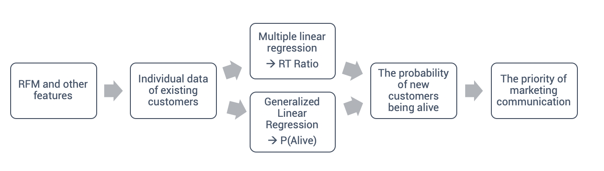

# Statistical-Data-Analysis-for-Business-and-Management

- NTU 2019 Fall Statistical Data Analysis for Business and Management
- Course Information： [syllabus](https://github.com/tzuhsuancheng/Statistical-Data-Analysis-for-Business-and-Management/blob/main/108-1_Business-Analytics_Syllabus_v1.pdf) 

## Project: Predicting the retention of new customer for online room booking platform
- In this project, we collaborate with AsiaYo, an online B&B booking platform company headquartered in Taiwan, to work together on solving their business problem using various statistical analysis methods. One challenge facing AsiaYo is customer retention, they want to find a better segmentation method for making more effective marketing communication. Considering each customer has their frequency for booking, we create RFM variables and then define a new variable called RT-Ratio(divide recency by frequency). Finally, we use the data of old customers with RFM and other multiple features to build:
  - (1) Multiple Linear Regression to predict RT-Ratio of new customer 
  - (2) GLM model to predict the probability of new customers being alive

- We define the old customer and new customer as below:
  - New customer (88%): customers who make only one purchase
  - Old customer (12%): customers who make more than one purchase in a specific period of time

## Assignment 1
Exploratory Data Analysis, Simple Regression

## Assignment 2
Multiple Linear Regression, Regression Model Building

## Assignment 3
Analysis of Covariance (ANCOVA), Linear Model, Analysis of Variance (ANOVA),  Design of Experiments

## Assignment 4
Odds and Contingency Tables

## Assignment 5
GLM: Logistic Regression for Binary Responses 

GLM: Logistic Regression for Binomial Counts

GLM: Log-Linear Regression for Poisson Counts 
